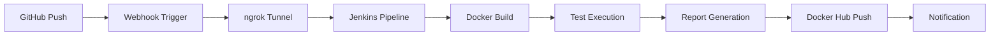

# 🚀 Professional API Automation Framework

> **A comprehensive API testing framework demonstrating advanced DevOps practices, CI/CD pipelines, and enterprise-grade automation techniques**

[](https://github.com/yourusername/API-Automation-Framework)
[](https://hub.docker.com/)
[](https://www.oracle.com/java/)
[](https://maven.apache.org/)
[](https://testng.org/)

## 🎯 Project Overview

This repository showcases my expertise in **API Test Automation** and **DevOps Engineering**. Built using industry best practices, this framework demonstrates:

- 🏗️ **Enterprise Architecture**: Production-ready automation framework design
- 💼 **Professional Standards**: Following methodologies used in Fortune 500 companies
- 🎪 **Technical Excellence**: Implementing cutting-edge tools and practices
- 🚀 **Career Readiness**: Demonstrating skills sought by top-tier technology companies

## ✨ Technical Implementations & Capabilities

### 🔧 **DevOps & CI/CD Excellence**
- ✅ **Complete CI/CD Pipeline**: GitHub → Jenkins → Docker → Automated Reports
- ✅ **Webhook Integration**: Real-time GitHub triggers via ngrok tunneling
- ✅ **Dockerized Testing**: Containerized test execution with Docker Hub integration
- ✅ **Data-Driven Testing**: Excel-based test data management with dynamic parameterization
- ✅ **Advanced Reporting**: ExtentReports with timestamped HTML reports and logs
- ✅ **Retry Mechanism**: Intelligent test retry logic for flaky test scenarios
- ✅ **Cross-Environment**: Properties-based configuration for multiple environments

### 🏗️ **Architecture & Design Patterns**
- ✅ **Page Object Model**: Scalable and maintainable test structure
- ✅ **Modular Framework**: Reusable components and utilities
- ✅ **Log4j2 Integration**: Enterprise-level logging with multiple log levels
- ✅ **Maven Build Management**: Professional dependency management and build automation
- ✅ **TestNG Test Management**: Parallel execution, grouping, and prioritization

## 🛠️ Tech Stack & Tools

| Category | Technology | Purpose |
|----------|------------|---------|
| **Language** | Java 17+ | Core development language |
| **Build Tool** | Maven 3.6.3+ | Dependency & build management |
| **Testing Framework** | TestNG | Test execution & management |
| **API Testing** | REST Assured | API automation & validation |
| **Reporting** | ExtentReports | Rich HTML test reports |
| **Logging** | Log4j2 | Comprehensive logging system |
| **CI/CD** | Jenkins | Automated build & deployment |
| **Containerization** | Docker & Docker Hub | Isolated test environments |
| **Tunneling** | ngrok | Local Jenkins exposure for webhooks |
| **Version Control** | Git & GitHub | Source code management |
| **Data Management** | Apache POI | Excel-based test data |

## 🏗️ Project Architecture

```
API-Automation-Framework/
├── 🐳 Dockerfile                    # Container configuration
├── 🔧 Jenkinsfile                   # CI/CD pipeline definition
├── 📦 pom.xml                       # Maven dependencies & plugins
├── 🧪 testng.xml                    # Test suite configuration
├── 📊 testData/                     # Excel test data files
│   └── UserData.xlsx
├── 📂 src/
│   ├── main/java/                   # Core framework utilities
│   └── test/java/api/
│       ├── 🔗 endpoints/            # API endpoint definitions
│       │   ├── Routes.java          # URL route constants
│       │   ├── UserEndpoints.java   # API method implementations
│       │   └── UserEndpointsPropertiesFile.java
│       ├── 📋 payload/              # Request/Response POJOs
│       │   └── User.java
│       ├── 🧪 tests/                # Test classes
│       │   ├── UserTests.java       # Individual API tests
│       │   └── DDTests.java         # Data-driven tests
│       └── 🛠️ utilities/            # Helper utilities
│           ├── ExtentReportManager.java
│           ├── DataProviders.java
│           ├── RetryAnalyzer.java
│           └── XLUtility.java
├── 📝 logs/                         # Auto-generated log files
├── 📊 reports/                      # HTML test reports
└── 🎯 target/                       # Maven build artifacts
```

## 🚀 CI/CD Pipeline Flow



### Pipeline Features:
1. **🔄 Automated Triggers**: GitHub webhooks via ngrok for instant builds
2. **🐳 Docker Integration**: Containerized test execution environment
3. **📊 Live Reporting**: Real-time HTML reports accessible via Jenkins
4. **🔍 Log Management**: Timestamped logs with different verbosity levels
5. **🚀 Hub Deployment**: Automated Docker image push to Docker Hub
6. **📧 Notifications**: Build status notifications and failure alerts

## 💼 Core Competencies Demonstrated

### **SDET/QA Automation Expertise:**
- API Testing Strategy & Implementation
- Test Framework Architecture & Design
- Data-Driven Testing Methodologies
- Continuous Integration/Continuous Deployment
- Docker Containerization for Testing
- Log Analysis & Debugging Techniques

### **DevOps Engineering Proficiency:**
- Jenkins Pipeline as Code
- Docker Multi-stage Builds
- Webhook Configuration & Management
- Infrastructure as Code Practices
- Automated Report Publishing
- Environment Configuration Management

### **Software Engineering Skills:**
- Object-Oriented Programming (Java)
- Design Patterns Implementation
- Maven Build Management
- Git Workflow & Best Practices
- Code Organization & Documentation
- Exception Handling & Retry Logic

## 🎯 Professional Experience Applied

This project demonstrates my hands-on experience with:

### **Technical Expertise:**
- Designing robust API testing frameworks using industry-standard tools
- Implementing enterprise-level CI/CD practices and containerization strategies
- Building scalable automation solutions that handle complex testing scenarios
- Architecting test frameworks that support multiple environments and data sources

### **Professional Approach:**
- Applying software engineering best practices to test automation
- Creating maintainable and scalable code architectures
- Implementing comprehensive logging and reporting mechanisms
- Building solutions that integrate seamlessly with development workflows

## 🎯 Professional Profile & Opportunities

This framework represents my capabilities and readiness for senior-level positions in:
- **Senior SDET/QA Automation Engineer** roles
- **DevOps Engineer** positions
- **Software Development Engineer in Test** opportunities
- **Technical Lead** positions in automation teams

### **Future Enhancements:**
- 🔄 Expanding test coverage with additional API endpoints
- 🌐 Adding cross-browser UI testing capabilities
- ☁️ Implementing cloud-based test execution (AWS/Azure)
- 📊 Integrating with test management tools (TestRail, Zephyr)
- 🔒 Adding security testing components (OWASP ZAP)

## 📞 Professional Network & Opportunities

I'm open to discussing how these skills and this technical approach can contribute to innovative teams and challenging projects. This repository demonstrates not just technical capabilities, but also the strategic thinking and professional execution that drives successful automation initiatives.

---

**💡 "Professional automation is about building robust, scalable solutions that deliver consistent value to development teams and business stakeholders."**

---

⭐ **This project exemplifies the technical expertise and professional approach I bring to automation engineering roles.**
